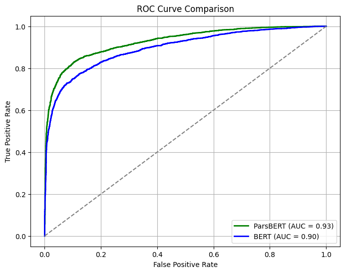
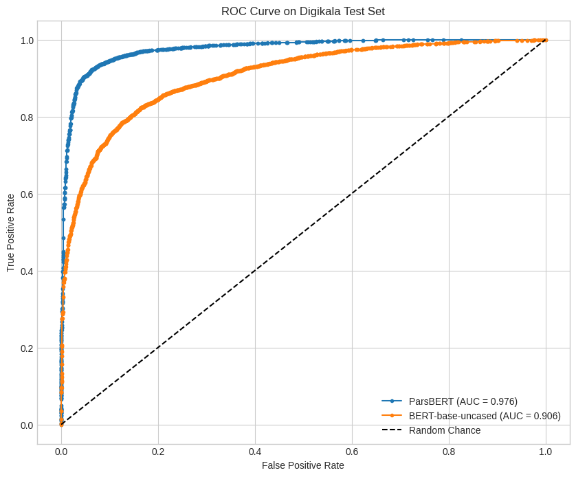

# Persian Sentiment Analysis: Comparing ParsBERT and Multilingual BERT

**Course:** Natural Language Processing 

**Institution:** University of Tehran, Faculty of Mathematics, Statistics, and Computer Science

---

## Project Overview

This project provides a comparative analysis between a language-specific Transformer model (**ParsBERT**) and a general multilingual model (**BERT**) for sentiment analysis on Persian text.

The core objective is to demonstrate that for a specific language task, a model pre-trained on a large corpus of that language will significantly outperform a more general model. The experiment also tests the models' ability to generalize to data from a different domain.

The full implementation can be found in `Sentiment_Analysis_in_Persian.ipynb`.

---

## Methodology

### 1. Models
Two pre-trained models from the Hugging Face Hub were used:
- **ParsBERT:** `HooshvareLab/bert-fa-base-uncased` — A BERT model pre-trained specifically on a massive Persian corpus.
- **Multilingual BERT:** `bert-base-uncased` — A standard BERT model pre-trained on text from 104 languages.

### 2. Fine-Tuning
The models were fine-tuned on the **Snappfood dataset**, a balanced collection of 7,000 Persian user reviews labeled as positive (1) or negative (0).

### 3. Generalization Test
To assess real-world robustness, the fine-tuned models were evaluated on a completely new, unseen dataset from a different domain: **Digikala**. This test set consisted of 6,910 product reviews, providing a robust measure of how well each model could generalize its learned sentiment patterns.

---

## Results

### On the Snappfood (In-Domain) Validation Set
Even on the in-domain data, ParsBERT showed superior performance across all metrics.

| Model      | Accuracy | F1-Score | AUC  |
| ---------- | -------- | -------- | ---- |
| **ParsBERT** | **86.01%** | **86.00%** | **0.97** |
| BERT       | 82.36%   | 82.28%   | 0.90 |


*(To make this image work, create an `images` folder and save the ROC curve from your report as `snappfood_roc.png`)*

### On the Digikala (Out-of-Domain) Test Set
The performance gap widened significantly on the generalization test. ParsBERT's deep understanding of Persian nuances allowed it to maintain high accuracy, while the generic BERT model struggled.

| Model      | Accuracy | F1-Score | AUC    |
| ---------- | -------- | -------- | ------ |
| **ParsBERT** | **93.13%** | **93.11%** | **0.976** |
| BERT       | 80.59%   | 81.22%   | 0.905  |


*(To make this image work, create an `images` folder and save the ROC curve from your report as `digikala_roc.png`)*

---

## Conclusion

The results decisively conclude that for NLP tasks in a specific language, **a language-specific pre-trained model like ParsBERT is vastly superior to a general multilingual model**. ParsBERT not only performs better on in-domain data but, more importantly, demonstrates a powerful ability to generalize to new, unseen domains, making it a much more reliable choice for real-world applications.

---

## How to Run

1.  **Clone the repository:**
    ```bash
    git clone https://github.com/your-username/persian-sentiment-analysis-bert.git
    cd persian-sentiment-analysis-bert
    ```

2.  **Create a virtual environment and install dependencies:**
    ```bash
    python -m venv venv
    source venv/bin/activate  # On Windows, use `venv\Scripts\activate`
    pip install -r requirements.txt
    ```

3.  **Launch Jupyter and run the notebook:**
    ```bash
    jupyter lab Sentiment_Analysis.ipynb
    ```
